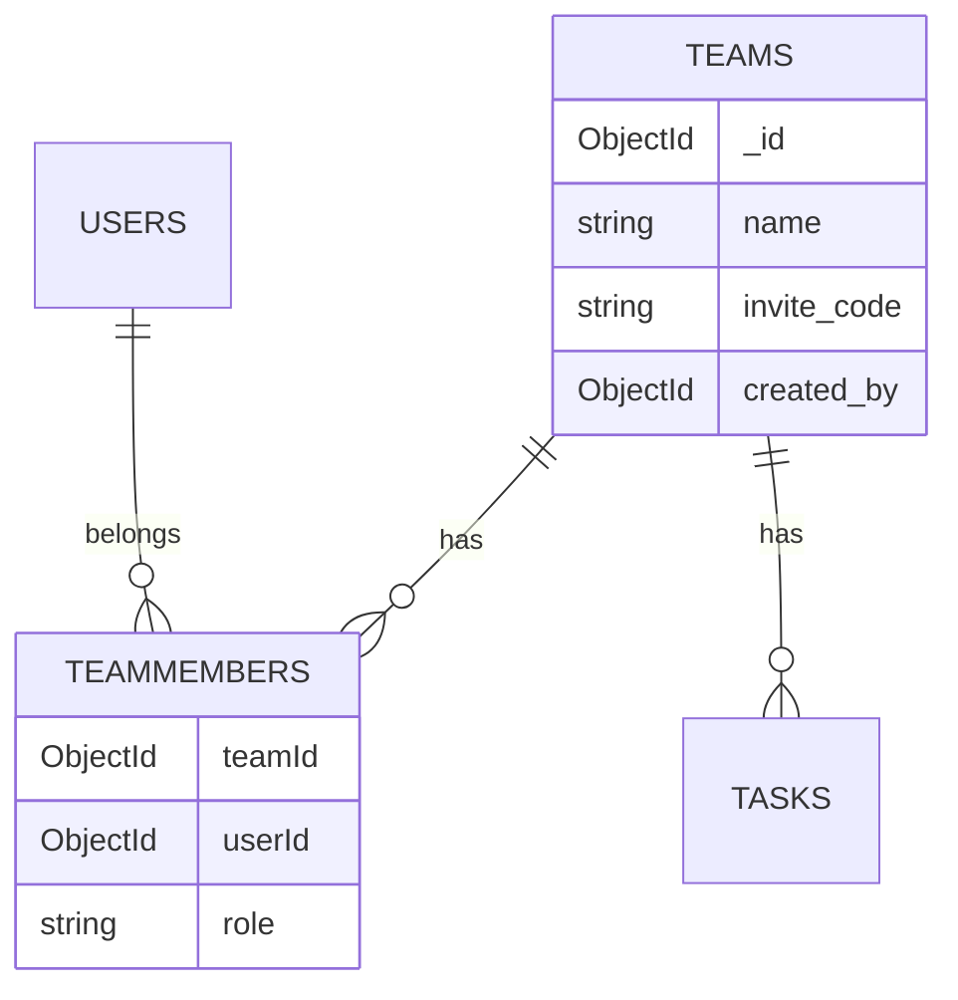

# Teams e membros (TeamMember)

Este documento descreve como times e membros são modelados na API, quais endpoints existem, regras de negócio e como testar.

---

## Visão geral

Um **time** (`teams`) é um grupo com nome, código de convite e criador. A relação entre **usuários** e **times** (com papel `boss` ou `member`) fica na coleção **`teammembers`** — não em um array embutido no documento do time.



### Por que não usar `members[]` embutido em `Team`?

Em versões anteriores o schema `Team` tinha `members: Member[]`, mas `create` e `join` **só gravavam** em `teammembers`. O array embutido permanecia vazio (`[]`), o que gerava confusão ao inspecionar o MongoDB ou chamar `GET /teams/:id`.

**Decisão atual:** fonte única de verdade = coleção `TeamMember` (`teammembers` no MongoDB).

---

## Schemas

### `Team` (`src/teams/schemas/team.schema.ts`)

| Campo        | Tipo     | Descrição                                      |
|-------------|----------|------------------------------------------------|
| `name`      | string   | Nome do time                                   |
| `invite_code` | string | Código de 8 caracteres (A–Z, 0–9), único, gerado automaticamente |
| `created_by` | ObjectId | Referência ao usuário criador               |

`generateInviteCode()` usa `crypto.randomInt` (Node.js), compatível com o build CommonJS do NestJS.

### `TeamMember` (`src/teams/schemas/team-member.schema.ts`)

| Campo   | Tipo     | Descrição                          |
|---------|----------|------------------------------------|
| `teamId` | ObjectId | Time                               |
| `userId` | ObjectId | Usuário                            |
| `role`  | enum     | `'boss'` ou `'member'` (default: `member`) |

---

## Endpoints

Todos os endpoints abaixo (exceto onde indicado) exigem JWT (`Authorization: Bearer <token>`).

| Método | Rota                    | Descrição                          |
|--------|-------------------------|------------------------------------|
| `POST` | `/teams`                | Criar time (criador vira `boss`)   |
| `POST` | `/teams/join`           | Entrar no time via `invite_code`   |
| `GET`  | `/teams/:id`            | Detalhe do time + lista `members`  |
| `GET`  | `/teams/:id/members`    | Listar membros do time             |
| `POST` | `/teams/:teamId/tasks`  | Criar tarefa (apenas `boss`)       |

Swagger: `http://localhost:8080/api-docs` (tag **Teams**).

---

## DTOs

### `JoinTeamDto` (`src/teams/dto/join-team.dto.ts`)

Body de `POST /teams/join`:

| Campo         | Validação              | Exemplo    |
|---------------|------------------------|------------|
| `invite_code` | string, 8 chars, alfanumérico | `AB12CD34` |

O `teamId` **não** vai no body; o time é resolvido pelo código.

---

## `TeamsService` — métodos

### `create(data, userId)`

Cria um time e registra o usuário como **boss** em `teammembers`.

1. Impede dois times com o mesmo `name` para o mesmo `created_by`.
2. Insere documento em `teams`.
3. Insere `{ teamId, userId, role: 'boss' }` em `teammembers`.

**Retorno:** `{ id, name }`

---

### `join(data, userId)`

Permite que um usuário entre em um time existente.

1. Normaliza `invite_code` (`trim` + `toUpperCase`).
2. Busca time por `invite_code` → se não existir: `404` (`Código de convite inválido`).
3. Verifica se já existe registro em `teammembers` para `(teamId, userId)` → se sim: `409` (`Você já faz parte deste time`).
4. Cria registro com `role: 'member'`.

**Retorno:** `{ id, name, role: 'member' }`

**Importante:** não altera o documento `teams`; apenas `teammembers`.

---

### `findOne(id)`

Retorna o time com membros agregados na resposta.

1. Busca `teams` por `_id` e popula `created_by`.
2. Se não existir: `404` (`Equipe não encontrada`).
3. Busca `teammembers` com `teamId` e popula `userId` (`name`, `email`, `avatarUrl`, `aura`).
4. Retorna `{ ...team, members }`.

Use este endpoint quando o front precisar do time **e** da lista de membros em uma única chamada.

---

### `getMembers(id)`

Lista membros de um time (endpoint dedicado).

1. Valida se o time existe (`findById`).
2. Se não existir: `404`.
3. Retorna documentos de `teammembers` com `userId` populado.

Equivalente a `findOne(id).members`, sem os demais campos do time.

---

### `createTask(teamId, data, userId)`

Cria tarefa no time; exige papel **boss** em `teammembers`.

1. Consulta `teammembers` com `teamId`, `userId` e `role: 'boss'`.
2. Se não for boss: `403` (`Você não é um boss deste time`).
3. Cria documento em `tasks` com `status: 'open'`.

A autorização usa `teammembers`, não um array embutido no time.

---

## Papéis (`role`)

| Papel    | Como obtém                         | Permissões atuais        |
|----------|------------------------------------|--------------------------|
| `boss`   | Criar o time (`POST /teams`)       | Criar tarefas no time    |
| `member` | Entrar via join (`POST /teams/join`) | (futuro: executar tarefas) |

---

## Como testar

### Via API (manual)

```http
# 1. Criar time — usuário A
POST /teams
Authorization: Bearer <token_A>
Content-Type: application/json

{ "name": "Squad Aura" }

# Anote o invite_code (Mongo ou resposta futura se exposto)

# 2. Entrar no time — usuário B
POST /teams/join
Authorization: Bearer <token_B>
Content-Type: application/json

{ "invite_code": "AB12CD34" }

# 3. Listar membros
GET /teams/<teamId>/members
Authorization: Bearer <token_A ou B>

# 4. Ver time com members na resposta
GET /teams/<teamId>
Authorization: Bearer <token>
```

Resposta esperada em `/members` ou em `findOne.members`: pelo menos 2 registros (boss + member), com `userId` populado.

### Via MongoDB

```javascript
// Membros (fonte de verdade)
db.teammembers.find({ teamId: ObjectId("SEU_TEAM_ID") })

// Time (sem array members embutido)
db.teams.findOne({ _id: ObjectId("SEU_TEAM_ID") })
```

### Testes automatizados

```bash
npm test -- teams.service.spec
```

Cenários cobertos:

- Join com código válido → cria em `teammembers`.
- Código inválido → `NotFoundException`.
- Usuário já membro → `ConflictException`.
- Join **não** grava em `teams.members[]` (apenas `teamMemberModel.create`).
- `getMembers` lê de `teammembers`.
- Time inexistente em `getMembers` → `NotFoundException`.

---

## Histórico de mudanças relevantes

| Mudança | Motivo |
|---------|--------|
| Remoção de `members[]` em `Team` | Evitar duplicidade e dados sempre vazios |
| `findOne` agrega `members` de `teammembers` | API coerente para o front |
| `getMembers` valida time + populate `userId` | 404 correto e payload útil |
| `join` grava só em `teammembers` | Modelo relacional escalável |
| `generateInviteCode` com `crypto` | Substituir `nanoid` (ESM) no build CJS |

---

## Referências no código

| Arquivo | Responsabilidade |
|---------|------------------|
| `src/teams/schemas/team.schema.ts` | Schema do time |
| `src/teams/schemas/team-member.schema.ts` | Schema membro ↔ time |
| `src/teams/teams.service.ts` | Regras de negócio |
| `src/teams/teams.controller.ts` | Rotas HTTP |
| `src/teams/dto/join-team.dto.ts` | Validação do body de join |
| `src/teams/teams.service.spec.ts` | Testes unitários |
