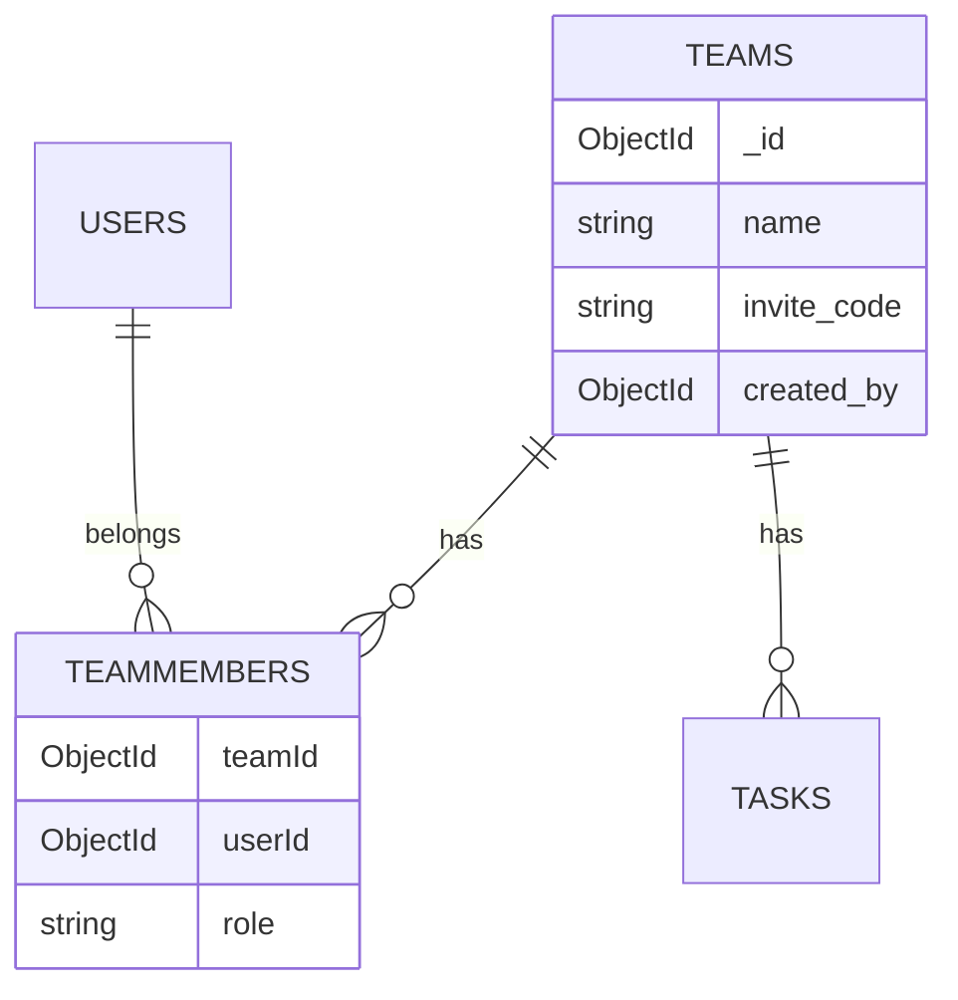

# Teams e membros (TeamMember)

Este documento descreve como times e membros são modelados na API, o módulo **feature-based** `team-members`, endpoints e como testar.

---

## Visão geral

Um **time** (`teams`) é um grupo com nome, código de convite e criador. A relação entre **usuários** e **times** (com papel `boss` ou `member`) fica na coleção **`teammembers`**, gerenciada pelo módulo `src/team-members/`.



**Fonte única de verdade:** coleção `TeamMember` (`teammembers`). O documento `teams` não embute lista de membros.

---

## Estrutura do módulo `team-members`

```
src/team-members/
├── team-members.module.ts
├── team-members.service.ts      # Regras de negócio e CRUD
├── team-members.controller.ts   # Rotas REST
├── schemas/
│   └── team-member.schema.ts
└── dto/
    ├── join-team.dto.ts
    ├── create-team-member.dto.ts
    └── update-team-member.dto.ts
```

O módulo `teams` importa `TeamMembersModule` e delega operações de membros ao `TeamMembersService`.

Ao criar um time (`TeamsService.create`), se o vínculo do boss falhar após o documento do time ser salvo, o time é **removido** (rollback) para não deixar times sem boss no banco.

---

## Schemas

### `TeamMember` (`src/team-members/schemas/team-member.schema.ts`)

| Campo   | Tipo     | Descrição                          |
|---------|----------|------------------------------------|
| `teamId` | ObjectId | Time                               |
| `userId` | ObjectId | Usuário                            |
| `role`  | enum     | `'boss'` ou `'member'` (default: `member`) |

---

## Endpoints

Todos exigem JWT (`Authorization: Bearer <token>`), exceto onde indicado.

### Team Members (CRUD)

| Método | Rota | Descrição |
|--------|------|-----------|
| `GET` | `/teams/:teamId/members` | Listar membros do time |
| `GET` | `/teams/:teamId/members/:id` | Buscar vínculo pelo `_id` em `teammembers` |
| `POST` | `/teams/:teamId/members` | Boss adiciona usuário (`userId`, `role?`) |
| `PATCH` | `/teams/:teamId/members/:id` | Boss altera papel (`role`) |
| `DELETE` | `/teams/:teamId/members/:id` | Boss remove outro ou membro sai do time |

### Ações globais

| Método | Rota | Descrição |
|--------|------|-----------|
| `POST` | `/team-members/join` | Entrar no time via `invite_code` (**recomendado**) |
| `GET` | `/team-members/me/teams` | Times do usuário autenticado |

### Teams (legado / agregado)

| Método | Rota | Descrição |
|--------|------|-----------|
| `POST` | `/teams` | Criar time (criador vira `boss` via `TeamMembersService`) |
| `POST` | `/teams/join` | Join legado — delega para `TeamMembersService` |
| `GET` | `/teams/:id` | Time + `members` agregados de `teammembers` |
| `POST` | `/teams/:teamId/tasks` | Criar tarefa (usa `assertBoss`) |

Swagger: tag **Team Members** e **Teams**.

---

## `TeamMembersService` — métodos

| Método | Descrição |
|--------|-----------|
| `create(teamId, userId, role)` | Cria vínculo; falha com 409 se já existir |
| `joinByInviteCode(dto, userId)` | Resolve time pelo `invite_code` e cria `member` |
| `findAllByTeam(teamId)` | Lista membros com `userId` populado |
| `findOne(teamId, memberId)` | Um vínculo por `_id` do documento |
| `findTeamsByUser(userId)` | Todos os times do usuário |
| `findMembership(teamId, userId)` | Busca vínculo (autorização interna) |
| `assertBoss(teamId, userId)` | Lança 403 se não for boss |
| `addByBoss(teamId, dto, requesterId)` | Boss adiciona membro manualmente |
| `updateRole(teamId, memberId, dto, requesterId)` | Boss muda papel; impede remover último boss |
| `remove(teamId, memberId, requesterId)` | Boss remove outro ou usuário sai; protege último boss |

---

## DTOs

### `JoinTeamDto`

```json
{ "invite_code": "AB12CD34" }
```

### `CreateTeamMemberDto` — `POST /teams/:teamId/members`

```json
{
  "userId": "507f1f77bcf86cd799439011",
  "role": "member"
}
```

### `UpdateTeamMemberDto` — `PATCH /teams/:teamId/members/:id`

```json
{ "role": "boss" }
```

---

## Regras de permissão

| Ação | Quem pode |
|------|-----------|
| Listar / ver membros | Qualquer autenticado (time deve existir) |
| Join | Usuário autenticado |
| Adicionar membro | Boss do time |
| Alterar papel | Boss do time |
| Remover outro | Boss do time |
| Sair do time | O próprio membro (`DELETE` no próprio vínculo) |
| Criar tarefa | Boss (`TeamsService` → `assertBoss`) |

**Proteções:** não rebaixar/remover o único boss do time.

---

## Como testar

### API

```http
POST /team-members/join
Authorization: Bearer <token>
{ "invite_code": "AB12CD34" }

GET /teams/<teamId>/members
Authorization: Bearer <token>

GET /team-members/me/teams
Authorization: Bearer <token>
```

### MongoDB

```javascript
db.teammembers.find({ teamId: ObjectId("...") })
```

### Testes unitários

```bash
npm test -- team-members
npm test -- teams.service
```

---

## Referências

| Arquivo | Responsabilidade |
|---------|------------------|
| `src/team-members/team-members.module.ts` | Módulo Nest |
| `src/team-members/team-members.service.ts` | CRUD e regras |
| `src/team-members/team-members.controller.ts` | HTTP |
| `src/teams/teams.service.ts` | Times; delega membros |
| `docs/teams-members.md` | Este documento |
